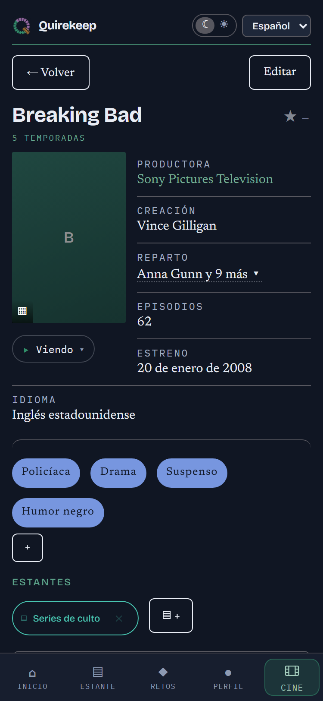
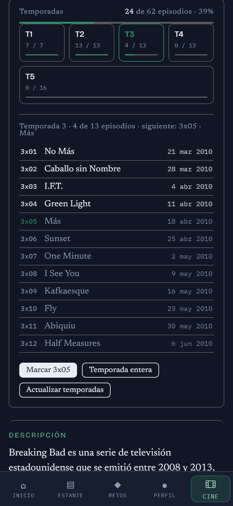

# Quirekeep

*[English](README.md)*

**[Abrir la app → quirekeep.pages.dev](https://quirekeep.pages.dev)**

Quirekeep es una libreta para lo que lees, ves y juegas. Los **libros** en un
sitio, las **películas y series** en otro, los **juegos** en un tercero, y los
tres en la misma app.

No hace falta cuenta ni hay que registrarse. Lo que escribes se queda en tu
móvil o en tu ordenador, y nadie más lo ve.

El nombre viene de la encuadernación: un *quire* es un cuadernillo de hojas
dobladas, la pieza con la que se cose un libro. Esta app guarda los tuyos.

---

## Qué puedes hacer con ella

Imagina tres estanterías en la misma habitación: una para libros, otra para
películas y series, y otra para juegos. Las tres funcionan igual.

- **Apuntar** todo lo que has leído, visto o jugado, y lo que quieres empezar
  después.
- **Marcar por dónde vas**: la página, el minuto, el episodio o un porcentaje.
- **Ponerle nota** sobre diez y escribir notas privadas.
- **Hacer tus propios estantes**, como «Vacaciones de verano» o «Para ver con
  Ana». Un título puede estar en todos los que quieras.
- **Ver tus números**: cuánto has terminado, en qué idiomas, qué te gusta más.
- **Ponerte retos**, como «24 libros este año», o una lista de consignas («un
  libro que pase en invierno») que vas rellenando.

Y hay tres páginas que lo juntan todo:

- **Inicio** enseña lo que tienes a medias, de los tres a la vez. Desde ahí
  mismo marcas un episodio como visto o un libro como terminado, y eliges el
  orden: por lo que llevas, por cuándo lo añadiste, alfabético o como a ti te
  guste. En el móvil, deja el dedo sobre un título para cambiar cómo va.
- **Estante** enseña lo que tienes entre manos, lo que viene después y lo que
  ya has terminado.
- **Retos** enseña cómo va cada uno de tus retos.

### Cada título se completa solo

Cuando abres un título, la app busca lo que puede y añade lo que falta: un
resumen corto en tu idioma, quién lo hizo (autor, dirección, guion, productora,
la editorial original) y los actores con el personaje de cada uno. Nunca cambia
nada de lo que hayas escrito tú.

En un libro, además, puedes elegir **la edición que tienes**: la editorial, el
año, la portada y el número de páginas. Si ibas por la mitad, sigues por la
mitad en la edición nueva.

La app está en **español e inglés**, y tiene un aspecto oscuro y otro claro,
como de papel.

---

## Apoyar el proyecto

Quirekeep es gratis, sin anuncios, sin cuentas y sin nada que desbloquear. Si
te sirve, puedes echar una mano en
**[ko-fi.com/alex_create](https://ko-fi.com/alex_create)**.

---

## Cómo se ve

Capturas de verdad, no dibujos. La misma app, colocada de una manera en el
móvil y de otra en una pantalla grande.

| Inicio | Biblioteca | Un título |
|---|---|---|
|  |  |  |
| Libros, películas y juegos a la vez: lo empezado y lo que viene. | Todo lo que tienes, con portadas o en lista. | La nota, por dónde vas y todo sobre el título. |

Una serie guarda sus temporadas, traídas de TVMaze: qué episodios has visto,
cuál toca ahora y cuándo se emitió cada uno.

| Una serie | Sus temporadas |
|---|---|
|  |  |
| Productora, creación, reparto y episodios. | Temporada a temporada, con el siguiente episodio listo para marcar. |

En una pantalla grande, libros, películas y juegos van uno al lado del otro:

Y el aspecto claro está diseñado aparte, no es el oscuro con los colores
cambiados:

  

---

## Cómo conseguirla

Quirekeep no está en la App Store ni en Google Play, y no hay nada que
descargar. Vive en una dirección web, y tu navegador puede guardártela como si
fuera una app: con su icono, abriéndose sola y funcionando incluso sin
internet.

> **La dirección: https://quirekeep.pages.dev**

**En un móvil Android** — abre la dirección en Chrome. Toca los tres puntos de
arriba a la derecha y luego *Instalar aplicación* (en móviles antiguos pone
*Añadir a pantalla de inicio*). Acepta.

**En un iPhone o iPad** — abre la dirección **en Safari** (tiene que ser
Safari). Toca el botón de compartir, el cuadrado con una flecha hacia arriba,
baja y toca *Añadir a pantalla de inicio*.

**En un ordenador Windows o Mac** — abre la dirección en Chrome o en Edge. Al
final de la barra donde se escribe la dirección hay un iconito de una pantalla
con una flecha: púlsalo. O busca *Instalar Quirekeep* en el menú del navegador.
Firefox no puede hacerlo; ahí la app funciona igual, pero como una pestaña
normal.

**Si no ves la opción de instalar**, seguramente estás en una ventana privada
o de incógnito. Abre una normal.

### Una vez instalada

- Se abre desde su icono, como cualquier otra app.
- Funciona sin internet. Solo hace falta conexión para buscar un título nuevo.
- Se actualiza sola. Nunca hay que reinstalar nada.
- No pide cuenta, ni correo, ni permisos.

---

## Tus notas son tuyas

Todo lo que escribes se guarda dentro del navegador de ese móvil u ordenador, y
en ningún sitio más. No se le manda a nadie. Esa es la gracia, y también quiere
decir que nadie te lo puede recuperar si se pierde.

Así que, de vez en cuando, haz una copia. En **Perfil**, pulsa *Descargar
copia*. Se guarda un archivo pequeño con todo. Con ese archivo puedes:

- **Restaurar** todo en un móvil nuevo.
- **Combinar** dos móviles u ordenadores en uno.

La app te recuerda cuánto hace de tu última copia.

Un aviso: si borras los datos guardados del navegador para esta página, tu
biblioteca se va con ellos. La copia es la manera de recuperarla.

Lo único que sale de tu dispositivo es una simple cuenta de visitas, para saber
cuánta gente abre la app. No usa cookies, no sabe quién eres y nunca ve lo que
hay en tu biblioteca.

**¿Ya llevas una lista en otro sitio?** Puedes traerla. Quirekeep lee los
archivos que se descargan de Goodreads, StoryGraph, Pagebound, Letterboxd y
Trakt, con tus notas, fechas y estantes.

---

## Si también usas otras páginas

Quizá también apuntas tus libros en Goodreads o tus películas en Letterboxd.
Quirekeep no entra en ellas ni las toca. Solo te ayuda a recordar **cuál de
ellas tiene ya cada título**, para saber qué te falta por añadir allí.

Cada título enseña una rayita de color por cada página. Toca una rayita para
decir «esta ya lo tiene».

Vienen puestas Booktower, StoryGraph, Pagebound y Goodreads para libros; IGN,
Backloggd y Steam para juegos; y Letterboxd y Trakt para películas y series.
Puedes apagar las que no uses o añadir las tuyas.

Con ellas encendidas, la app enseña lo que le falta a cada página, listo para
copiar. Con todas apagadas no se rompe nada: esa lista se queda vacía.

---

## De dónde sale la información

Solo de fuentes libres y gratuitas que no piden cuenta:

- **Open Library** para los libros, sus ediciones y sus portadas.
- **Wikidata** para películas, series y juegos: quién los hizo, el año, la
  duración, el idioma y el reparto.
- **Wikipedia** para el resumen corto, en tu idioma.
- **TVMaze** para las temporadas y episodios de una serie, con la fecha en que
  sale cada uno, y los personajes de su reparto.

No hay ninguna fuente gratuita de portadas para películas, series y juegos, así
que esos enseñan una tarjeta de color con el título. En los móviles que lo
permiten, puedes escanear el código de barras de un libro con la cámara en vez
de escribir su número.

---

## Licencia

El código de la app no está publicado; esta página tiene la explicación y el
enlace a la app. Tanto la app como estos textos son propietarios, con todos los
derechos reservados: nadie puede copiarlos ni reutilizarlos sin permiso — está
en [LICENSE](LICENSE).
