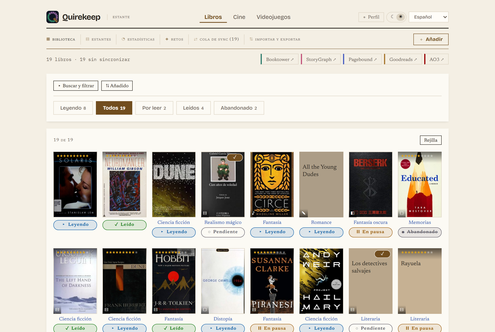
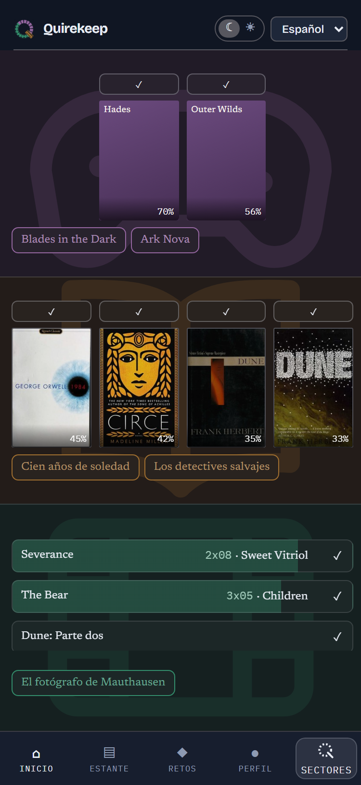
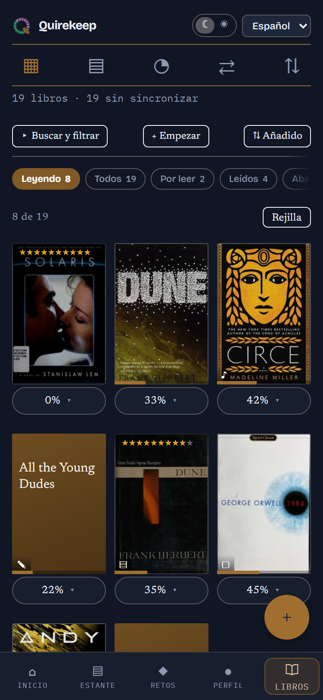
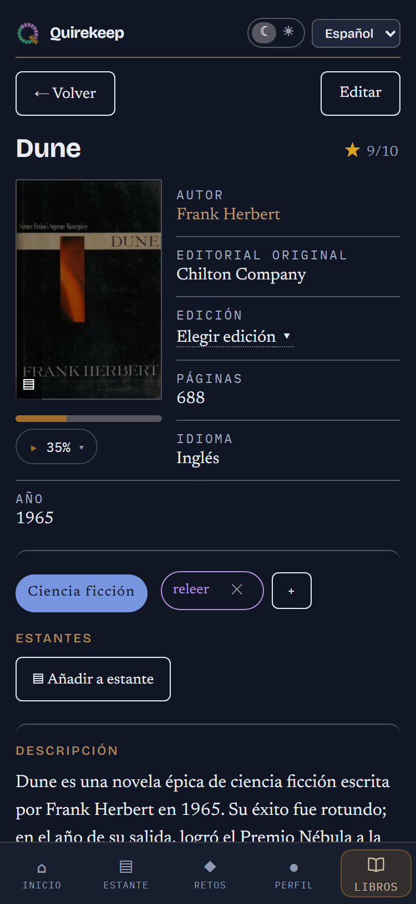
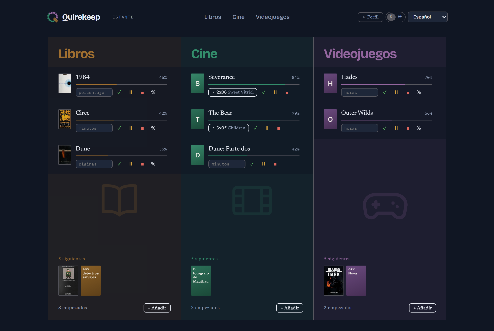
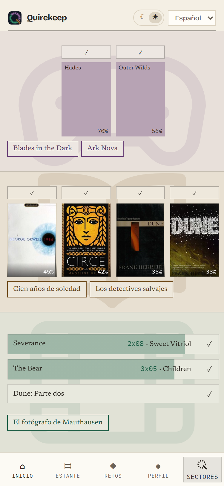

# Quirekeep

*[Español](README.es.md)*

**[Open the app → quirekeep.pages.dev](https://quirekeep.pages.dev)**

Quirekeep is a notebook for the things you read, watch and play. **Books** in
one place, **films and series** in another, **games** in a third, and all
three in the same app.

You need no account and there is nothing to sign up for. What you write stays
on your phone or computer, and nobody else sees it.

The name comes from bookbinding: a *quire* is a bundle of folded pages, the
piece a book is sewn together from. This app keeps yours.

---

## What you can do with it

Think of three bookcases in one room: one for books, one for films and series,
one for games. Each one works the same way.

- **Keep a list** of everything you have read, watched or played, and of what
  you want to start next.
- **Mark where you are**: the page, the minute, the episode or a percentage.
- **Give it a mark** out of ten and write private notes.
- **Make your own shelves**, like "Summer holidays" or "Watch with Ana". A title
  can be on as many as you like.
- **See your numbers**: how much you have finished, in which languages, what you
  like most.
- **Set yourself challenges**, like "24 books this year", or a list of prompts
  ("a book set in winter") that you fill in as you go.

There are also three pages that bring everything together:

- **Home** shows what you are in the middle of, in all three at once. You can
  mark an episode as watched or a book as finished right there, and choose the
  order: how far along you are, when you added it, alphabetical, or just the
  way you like. On a phone, keep your finger on a title to change how it is
  going.
- **Shelf** shows what you have on the go now, what comes next, and what you
  have finished.
- **Challenges** shows how each of your challenges is going.

### Each title fills itself in

When you open a title, the app looks up what it can and adds what is missing:
a short summary in your language, who made it (author, director, writers,
studio, the original publisher), and the actors with the characters they play.
It never changes anything you wrote yourself.

For a book, you can also pick **the edition you have**: the publisher, the
year, the cover and the number of pages. If you were halfway through, you stay
halfway through in the new edition.

The app speaks **English and Spanish**, and comes in a dark look and a light,
paper-like one.

---

## Support it

Quirekeep is free, has no ads, no accounts and nothing to unlock. If it earns
its place, you can chip in at:
**[ko-fi.com/alex_create](https://ko-fi.com/alex_create)**.

---

## What it looks like

Real screenshots, not drawings. The same app, arranged one way on a phone and
another on a big screen.

| Home | Library | A title |
|---|---|---|
|  |  |  |
| Books, films and games at once: what you have started, and what comes next. | Everything you have, with covers or as a list. | The mark, where you are, and everything about the title. |

On a big screen, books, films and games sit side by side:

And the light look is designed on its own, not just the dark one with the
colours swapped:

  

---

## How to get it

Quirekeep is not in the App Store or Google Play, and there is nothing to
download. It lives at a web address, and your browser can keep it for you like
an app: with its own icon, opening on its own, and working even with no
internet.

> **The address: https://quirekeep.pages.dev**

**On an Android phone** — open the address in Chrome. Tap the three dots at
the top right, then *Install app* (on older phones it says *Add to Home
screen*). Say yes.

**On an iPhone or iPad** — open the address **in Safari** (it has to be
Safari). Tap the share button, the square with an arrow pointing up, scroll
down and tap *Add to Home Screen*.

**On a Windows or Mac computer** — open the address in Chrome or Edge. At the
right end of the bar where the address is written there is a small icon of a
screen with an arrow: click it. Or look for *Install Quirekeep* in the
browser's menu. Firefox cannot do this; the app still works there, but as a
normal tab.

**If you cannot see the install option**, you are probably in a private or
incognito window. Open a normal one.

### Once it is installed

- It opens from its icon, like any other app.
- It works without internet. You only need a connection to look up a new title.
- It updates itself. There is never anything to reinstall.
- It asks for no account, no email and no permissions.

---

## Your notes are yours

Everything you write is saved inside the browser on that phone or computer,
and nowhere else. It is not sent to anyone. That is the point — and it also
means nobody can recover it for you if it is lost.

So, now and then, make a copy. In **Profile**, press *Download a backup*. It
saves one small file with everything. With that file you can:

- **Restore** everything on a new phone.
- **Merge** two phones or computers into one.

The app reminds you how long it has been since your last copy.

One warning: if you clear your browser's saved data for this site, your
library goes with it. Your copy is how you get it back.

The only thing that leaves your device is a simple count of visits, so the app
knows how many people open it. It uses no cookies, does not know who you are,
and never sees what is in your library.

**Already keep a list somewhere else?** You can bring it in. Quirekeep reads the
files you can download from Goodreads, StoryGraph, Pagebound, Letterboxd and
Trakt, with your marks, dates and shelves.

---

## If you also use other sites

Maybe you also keep your books on Goodreads or your films on Letterboxd.
Quirekeep does not log into them and does not touch them. It only helps you
remember **which of them already has each title**, so you know what is left
to add there.

Each title shows a small coloured stripe for each site. Tap a stripe to say
"this one is already there".

It comes with Booktower, StoryGraph, Pagebound and Goodreads for books; IGN,
Backloggd and Steam for games; and Letterboxd and Trakt for films and series.
You can turn off the ones you do not use, or add your own.

With them on, the app lists what each site is still missing, ready to copy.
With them all off, nothing breaks: that list is simply empty.

---

## Where the information comes from

Only from free, open sources that need no account:

- **Open Library** for books, their editions and their covers.
- **Wikidata** for films, series and games: who made them, the year, the
  length, the language and the cast.
- **Wikipedia** for the short summary, in your language.
- **TVMaze** for the seasons and episodes of a series, with the date each one
  comes out, and the characters in its cast.

There is no free source of covers for films, series and games, so those show a
coloured card with the title instead. On phones that allow it, you can scan a
book's barcode with the camera instead of typing its number.

---

## Licence

The app's code is not published; this page holds the explanation and the link
to the app. Both the app and these texts are proprietary, all rights reserved:
nobody may copy or reuse them without permission — see [LICENSE](LICENSE).
